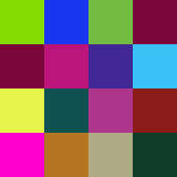

# hashpad

HashPad NFT project is synesthesia of cryptography art and real world

---

Each image created from **AHS256** hash of original word and represented as 16 (4x4 pixel image) **R5G6B5** pixels translated to **RGB32**.

Let say **LOVE** as a sample
```
hash = SHA256("LOVE")
```
will give us hehadecimal value ```86c019bd75e878270f75b8af41523e1ee789128aa9b188e3f819b3a4ad5011e5```

which can be translated into **16** unsigned short values
```
[34496, 6589, 30184, 30759, 3957, 47279, 16722, 15902, 
59273, 4746, 43441, 35043, 63513, 45988, 44368, 4581]
```

each of them may be represented as **RGB16** and then as **RGB24** value
```
34496
rgb16 -  16 54 0
rgb24 -  132 219 0
84db00
```

repeating sequence will geve us 4x4 color image as visualisation of original word **LOVE**



